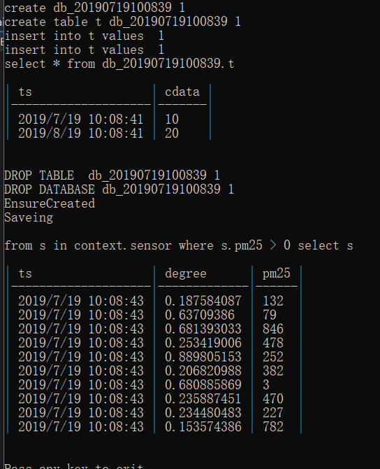

# Maikebing.EntityFrameworkCore.Taos

## 项目简介


Entity, Framework, EF, Core, Data, O/RM, entity-framework-core,TDengine
--

Maikebing.Data.Taos  是一个采用TDengine的原生动态库构建的ADO.Net提供程序。 它将允许你通过.Net Core 访问TDengine 数据库。目前已经支持Linux  64位、Windows 64位、Windows 32位系统 .

---

Maikebing.EntityFrameworkCore.Taos 是一个Entity Framework Core 的提供器， 基于Maikebing.Data.Taos实现。 


---

[](https://ci.appveyor.com/project/MaiKeBing/maikebing-entityframeworkcore-taos)
[](https://github.com/maikebing/Maikebing.EntityFrameworkCore.Taos/blob/master/LICENSE)
[](https://www.nuget.org/packages/Maikebing.Data.Taos/)
[](https://www.nuget.org/packages/Maikebing.EntityFrameworkCore.Taos/)

---
## 目前支持的版本


| 操作系统    | 支持版本 | 注意事项                                                     |
| ----------- | -------- | ------------------------------------------------------------ |
| Windows X86 | 1.6.5.9  | 连接高于此版本的TD会提示版本不匹配                           |
| Windows X64 | 1.6.6.1  | 连接高于此版本的TD会提示版本不匹配                           |
| Linux X64   | 2.0.1.0  | Linux注意一定执行官方的install_client.sh脚本，否则会提示dll无法找到 |


## 如何安装？

 ` Install-Package Maikebing.Data.Taos`
 ` Install-Package Maikebing.EntityFrameworkCore.Taos`

##  如何使用？

 例子:



```C#
    ///Specify the name of the database
    string database = "db_" + DateTime.Now.ToString("yyyyMMddHHmmss");
      string database = "db_" + DateTime.Now.ToString("yyyyMMddHHmmss");
      var builder = new TaosConnectionStringBuilder()
      {
            DataSource = "127.0.0.1",
            DataBase = database,
            Username = "root",
            Password = "kissme",
            Port=6060
            };
    //Example for ADO.Net 
    using (var connection = new TaosConnection(builder.ConnectionString))
    {
        connection.Open();
        Console.WriteLine("create {0} {1}", database, connection.CreateCommand($"create database {database};").ExecuteNonQuery());
        Console.WriteLine("create table t {0} {1}", database, connection.CreateCommand($"create table {database}.t (ts timestamp, cdata int);").ExecuteNonQuery());
        Console.WriteLine("insert into t values  {0}  ", connection.CreateCommand($"insert into {database}.t values ('{DateTime.Now.ToString("yyyy-MM-dd HH:mm:ss.ms")}', 10);").ExecuteNonQuery());
        Console.WriteLine("insert into t values  {0} ", connection.CreateCommand($"insert into {database}.t values ('{DateTime.Now.AddMonths(1).ToString("yyyy-MM-dd HH:mm:ss.ms")}', 20);").ExecuteNonQuery());
        var cmd_select = connection.CreateCommand();
        cmd_select.CommandText = $"select * from {database}.t";
        var reader = cmd_select.ExecuteReader();
        Console.WriteLine(cmd_select.CommandText);
        Console.WriteLine("");
        ConsoleTableBuilder.From(reader.ToDataTable()).WithFormat(ConsoleTableBuilderFormat.MarkDown).ExportAndWriteLine();
        Console.WriteLine("");
        Console.WriteLine("DROP TABLE  {0} {1}", database, connection.CreateCommand($"DROP TABLE  {database}.t;").ExecuteNonQuery());
        Console.WriteLine("DROP DATABASE {0} {1}", database, connection.CreateCommand($"DROP DATABASE   {database};").ExecuteNonQuery());
        connection.Close();
    }
    //Example for  Entity Framework Core  
    using (var context = new TaosContext(new DbContextOptionsBuilder()
                                            .UseTaos(builder.ConnectionString).Options))
    {
        Console.WriteLine("EnsureCreated");
        context.Database.EnsureCreated();
        for (int i = 0; i < 10; i++)
        {
            var rd = new Random();
            context.sensor.Add(new sensor() { ts = DateTime.Now.AddMilliseconds(i), degree = rd.NextDouble(), pm25 = rd.Next(0, 1000) });
        }
        Console.WriteLine("Saveing");
        context.SaveChanges();
        Console.WriteLine("");
        Console.WriteLine("from s in context.sensor where s.pm25 > 0 select s ");
        Console.WriteLine("");
        var f = from s in context.sensor where s.pm25 > 0 select s;
        var ary = f.ToArray();
        ConsoleTableBuilder.From(ary.ToList()).WithFormat(ConsoleTableBuilderFormat.MarkDown).ExportAndWriteLine();
        context.Database.EnsureDeleted();
    }
    Console.WriteLine("");
    Console.WriteLine("Pass any key to exit....");
    Console.ReadKey();
```
