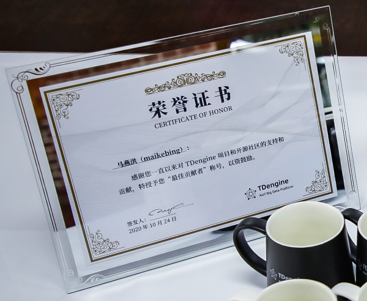

# IoTSharp.EntityFrameworkCore.Taos

## 项目简介


ADO.Net Entity, Framework, EF, Core, Data, O/RM, entity-framework-core,TDengine
--

IoTSharp.Data.Taos  是 TDengine的ADO.Net提供程序。 它将允许你通过原生动态库、WebSocket、RESTful 三种协议访问TDengine，通过 Schemaless 完美实现了ExecuteBulkInsert批量插入、Stmt 实现了参数化执行。

连接协议说明
---
| 协议    | 使用|依赖| 说明                                                     |
| ----------|--- | --------  | ------------------------------------------------------------ |
| WebSocket |builder.UseWebSocket()|无依赖 | 纯C#实现， 支持 Schemaless 和 Stmt参数化
| Cloud DSN |builder_cloud.UseCloud_DSN()|无依赖 | 纯C#实现， 支持 Schemaless 和 Stmt参数化  
| Native | builder.UseNative()|libtaos | 原生协议， 支持3.0.x  libtaos 动态库，支持 Schemaless 和 Stmt参数化。使用前必须安装 TDengine-client 
| RESTful | builder.UseRESTful() |无依赖|   纯C#实现， 不支持  Schemaless 和 Stmt参数化

连接字符串示例
---
| 连接方式    |  示例                                                     |
| ----------| ------------------------------------------------------------ |
| TDengine云服务 | Data Source=gw.us-east.azure.cloud.tdengine.com;DataBase=iotsharp;Username=root;Password=taosdata;Port=80;PoolSize=20;Protocol=WebSocket;Token=4592d868d1b57c812edb3d8c11b4bbd1ffc747c0
| 使用原生库libtaos  |Data Source=DEVPER;DataBase=db_20230301123636;Username=root;Password=taosdata;Port=6030;PoolSize=20;Protocol=Native
| 使用 Http RESTful  |Data Source=DEVPER;DataBase=db_20230301123636;Username=root;Password=taosdata;Port=6041;PoolSize=20;Protocol=RESTful
| 使用 WebSocket  |Data Source=DEVPER;DataBase=db_20230301123636;Username=root;Password=taosdata;Port=6041;PoolSize=20;Protocol=WebSocket


## Schemaless 

通过 Schemaless 实现的 ExecuteBulkInsert  支持 TSDB_SML_LINE_PROTOCOL 和TSDB_SML_JSON_PROTOCOL 。
透过TSDB_SML_JSON_PROTOCOL也支持了InfluxDB Client中的 RecordData 的数据写法。 

 RecordData示例
```c#
  var rec=  RecordData.table("meters").Tag("location", "Beijing.Haidian").Tag("groupid", "2").Timestamp(DateTime.Now.ToUniversalTime(), TimePrecision.Ms)
                .Field("current", 12.1).Field("voltage", 234.0).Field("phase",0.33);
            int result = connection.ExecuteBulkInsert(rec);

```


IoTSharp.EntityFrameworkCore.Taos 是一个Entity Framework Core 的提供器， 基于IoTSharp.Data.Taos实现。 
(原名称为 Maikebing.EntityFrameworkCore.Taos)

---

[](https://ci.appveyor.com/project/iotsharp/entityframeworkcore-taos)
[](https://github.com/IoTSharp/EntityFrameworkCore.Taos/blob/master/LICENSE)


| NuGet名称    | 版本|下载量| 说明                                                     |
| ----------- | --------  | --------  | ------------------------------------------------------------ |
| IoTSharp.Data.Taos |[](https://www.nuget.org/packages/IoTSharp.Data.Taos/) | |ADO.Net Core 基础组件
| IoTSharp.EntityFrameworkCore.Taos |[](https://www.nuget.org/packages/IoTSharp.EntityFrameworkCore.Taos/) |     | 供EF Core使用的组件
| IoTSharp.HealthChecks.Taos |[](https://www.nuget.org/packages/IoTSharp.HealthChecks.Taos/)  |  | 供Asp.Net Core 使用的健康检查组件


---


[TDengine技术开放日 — 从技术创新和设计思想，认识TDengine](https://live.photoplus.cn/live/pc/38916035/#/live)




##  如何使用？


 ### 基本示例:

```csharp
    ///Specify the name of the database
    string database = "db_" + DateTime.Now.ToString("yyyyMMddHHmmss");
      string database = "db_" + DateTime.Now.ToString("yyyyMMddHHmmss");
      var builder = new TaosConnectionStringBuilder()
      {
            DataSource = "127.0.0.1",
            DataBase = database,
            Username = "root",
            Password = "kissme",
            Port=6060
            };
    //Example for ADO.Net 
    using (var connection = new TaosConnection(builder.ConnectionString))
    {
        connection.Open();
        Console.WriteLine("create {0} {1}", database, connection.CreateCommand($"create database {database};").ExecuteNonQuery());
        Console.WriteLine("create table t {0} {1}", database, connection.CreateCommand($"create table {database}.t (ts timestamp, cdata int);").ExecuteNonQuery());
        Console.WriteLine("insert into t values  {0}  ", connection.CreateCommand($"insert into {database}.t values ('{DateTime.Now.ToString("yyyy-MM-dd HH:mm:ss.ms")}', 10);").ExecuteNonQuery());
        Console.WriteLine("insert into t values  {0} ", connection.CreateCommand($"insert into {database}.t values ('{DateTime.Now.AddMonths(1).ToString("yyyy-MM-dd HH:mm:ss.ms")}', 20);").ExecuteNonQuery());
        var cmd_select = connection.CreateCommand();
        cmd_select.CommandText = $"select * from {database}.t";
        var reader = cmd_select.ExecuteReader();
        Console.WriteLine(cmd_select.CommandText);
        Console.WriteLine("");
        ConsoleTableBuilder.From(reader.ToDataTable()).WithFormat(ConsoleTableBuilderFormat.MarkDown).ExportAndWriteLine();
        Console.WriteLine("");
        Console.WriteLine("DROP TABLE  {0} {1}", database, connection.CreateCommand($"DROP TABLE  {database}.t;").ExecuteNonQuery());
        Console.WriteLine("DROP DATABASE {0} {1}", database, connection.CreateCommand($"DROP DATABASE   {database};").ExecuteNonQuery());
        connection.Close();
    }
    //Example for  Entity Framework Core  
    using (var context = new TaosContext(new DbContextOptionsBuilder()
                                            .UseTaos(builder.ConnectionString).Options))
    {
        Console.WriteLine("EnsureCreated");
        context.Database.EnsureCreated();
        for (int i = 0; i < 10; i++)
        {
            var rd = new Random();
            context.sensor.Add(new sensor() { ts = DateTime.Now.AddMilliseconds(i), degree = rd.NextDouble(), pm25 = rd.Next(0, 1000) });
        }
        Console.WriteLine("Saveing");
        context.SaveChanges();
        Console.WriteLine("");
        Console.WriteLine("from s in context.sensor where s.pm25 > 0 select s ");
        Console.WriteLine("");
        var f = from s in context.sensor where s.pm25 > 0 select s;
        var ary = f.ToArray();
        ConsoleTableBuilder.From(ary.ToList()).WithFormat(ConsoleTableBuilderFormat.MarkDown).ExportAndWriteLine();
        context.Database.EnsureDeleted();
    }
    Console.WriteLine("");
    Console.WriteLine("Pass any key to exit....");
    Console.ReadKey();
```


### 用于物联网的超级表示例:

[IoTSharp/Storage/TaosStorage.cs](https://github.com/IoTSharp/IoTSharp/blob/master/IoTSharp/Storage/TaosStorage.cs)

```c#

   using (var connection = new TaosConnection(builder.ConnectionString))
            {
                connection.Open();
                Console.WriteLine("ServerVersion:{0}", connection.ServerVersion);
                connection.CreateCommand("DROP DATABASE IF EXISTS  IoTSharp").ExecuteNonQuery();
                connection.CreateCommand("CREATE DATABASE IoTSharp KEEP 365 DAYS 10 BLOCKS 4;").ExecuteNonQuery();
                connection.ChangeDatabase("IoTSharp");
                connection.CreateCommand("CREATE TABLE IF NOT EXISTS telemetrydata  (ts timestamp,value_type  tinyint, value_boolean bool, value_string binary(10240), value_long bigint,value_datetime timestamp,value_double double)   TAGS (deviceid binary(32),keyname binary(64));").ExecuteNonQuery();
                //connection.CreateCommand($"CREATE TABLE dev_Thermometer USING telemetrydata TAGS (\"Temperature\")").ExecuteNonQuery();
                var devid = $"{Guid.NewGuid():N}";
                UploadTelemetryData(connection, devid, "Temperature", 999);
                UploadTelemetryData(connection,devid,   "Humidity", 888);
                var devid2 = $"{Guid.NewGuid():N}";
                UploadTelemetryData(connection, devid2, "Temperature", 777);
                UploadTelemetryData(connection, devid2, "Humidity", 666);
                var reader2 = connection.CreateCommand("select last_row(*) from telemetrydata group by deviceid,keyname ;").ExecuteReader();
                ConsoleTableBuilder.From(reader2.ToDataTable()).WithFormat(ConsoleTableBuilderFormat.Default).ExportAndWriteLine();
                connection.Close();
            }
            
             static void UploadTelemetryData(  TaosConnection connection, string devid, string keyname, int count)
        {
            for (int i = 0; i < count; i++)
            {
                connection.CreateCommand($"INSERT INTO device_{devid}_{keyname} USING telemetrydata TAGS(\"{devid}\",\"{keyname}\")  (ts,value_type,value_long) values (now,2,{i});").ExecuteNonQuery();
            }
        }
        
```

